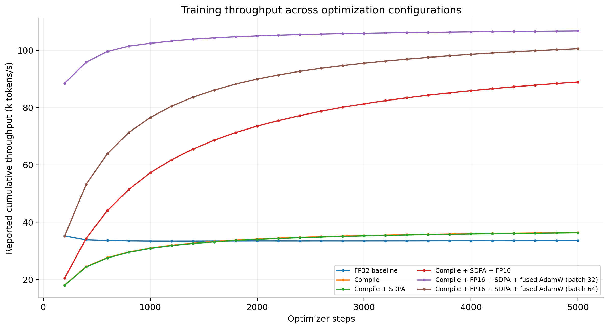
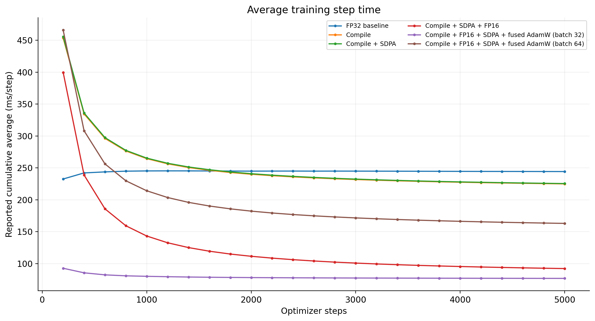
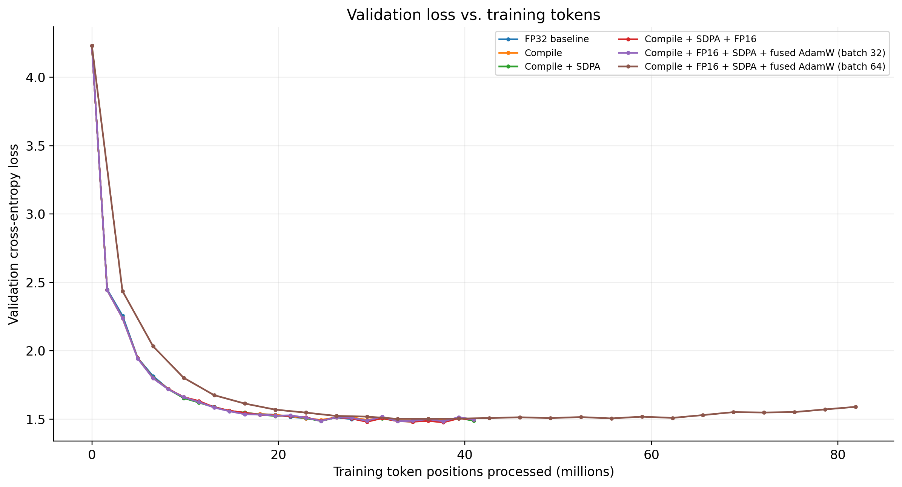
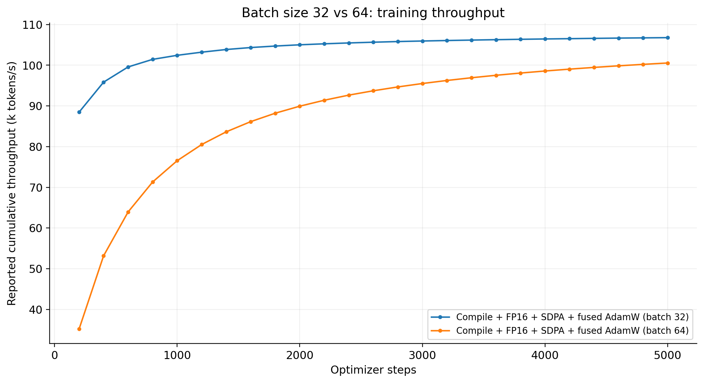
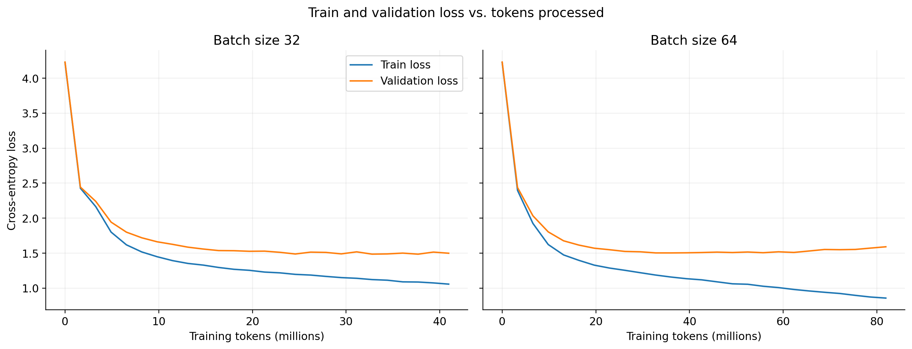

# Training a small GPT on a T4: an optimization log

I built a character-level GPT in PyTorch, then used it to explore a practical question: which training optimizations actually help on a single NVIDIA T4? Rather than changing everything at once, I added compilation, an attention rewrite, mixed precision, and a fused optimizer in sequence. I also tested whether doubling the batch size improved throughput.

This repository records the code used to plot the results and the raw training logs. It is an experiment with a **10.79M-parameter model**, not a claim about performance at large-model scale. The most noticeable result in this set of runs was an increase in *reported cumulative training throughput* from roughly **33.5k to 106.8k token positions/s** (about **3.18×**) at batch size 32. These figures include early-run overhead and should not be confused with warmed-up steady-state throughput.

## Model and measurement setup

| Item | Setting |
| --- | --- |
| Task | Character-level next-token prediction on Shakespeare text |
| GPU | NVIDIA T4 (Google Colab) |
| Model size | 10,788,929 parameters |
| Transformer | 6 layers, 6 attention heads, embedding dimension 384 |
| Sequence length | 256 tokens |
| Batch size | 32, except the final experiment at 64 |
| Optimizer | AdamW, learning rate `3e-4` |
| Training | 5,000 optimizer updates per run |
| Evaluation | Train and validation losses sampled periodically |

At batch size 32, each update processes `32 × 256 = 8,192` input token positions; batch size 64 processes `16,384`. These are **character-token positions**, not unique training characters, and they are not directly comparable to the number of subword tokens used in most larger LLM benchmarks.

The recorded time covers the forward pass, backward pass, and optimizer update. It excludes batch preparation and evaluation. GPU synchronization was used around the timed region. The log reports average step time and throughput that **appear to be cumulative from the start of each run**: compilation and early warm-up can therefore affect even the final reported average. There are no repeated-run error bars or peak-VRAM measurements in this experiment.

## The sequence of experiments

Each row *adds to the preceding configuration*. In particular, **both fused-AdamW runs retain `torch.compile`, SDPA, and FP16 autocast**.

| Run | Configuration | Batch | Final logged throughput (token positions/s) | Final logged mean step time |
| --- | --- | ---: | ---: | ---: |
| 1 | FP32 baseline: manual attention, regular AdamW | 32 | 33,542 | 244.23 ms |
| 2 | Baseline + `torch.compile` | 32 | 36,423 | 224.91 ms |
| 3 | Run 2 + scaled dot-product attention (SDPA) | 32 | 36,347 | 225.38 ms |
| 4 | Run 3 + FP16 autocast | 32 | 88,910 | 92.14 ms |
| 5 | Run 4 + fused AdamW | 32 | 106,777 | 76.72 ms |
| 6 | Same full stack as run 5, batch size 64 | 64 | 100,545 | 162.95 ms |

*Values are transcribed from the final entries in the supplied log, not independently repeated benchmarks.*

### 1. Start with a straightforward FP32 baseline

The starting model uses ordinary PyTorch linear layers, explicitly computed causal attention, and AdamW. This provides a reference before introducing compiler or mixed-precision effects. At the end of the baseline run, the log reports **33,542 token positions/s**, with a cumulative mean of **244.23 ms/update**.

### 2. Compile the model

`torch.compile(model)` lets PyTorch capture and optimize parts of the model computation, potentially reducing Python and kernel-launch overhead and fusing compatible operations. Compilation itself has an up-front cost, particularly on the first execution.

Adding compilation moved the final logged figure to **36,423 token positions/s**. The early compiled measurements were much slower, so the changing cumulative average is as important to understand as the final number. I would not interpret this plot as a steady-state compiler speedup.



*Figure 1. Throughput reported at each evaluation checkpoint. The compiled runs' early measurements include setup and warm-up effects; the curves are not instantaneous tokens/s.*

### 3. Replace manual attention with SDPA

The initial attention implementation explicitly builds the attention-score matrix, applies a causal mask, runs softmax and dropout, and multiplies by the values. `torch.nn.functional.scaled_dot_product_attention` expresses this as one operation and allows PyTorch to select an available optimized backend. Causal masking is handled by `is_causal=True`; dropout must be set to zero during evaluation.

```python
out = F.scaled_dot_product_attention(
    q, k, v,
    is_causal=True,
    dropout_p=dropout if self.training else 0.0,
)
```

This experiment is labeled **SDPA**, not guaranteed FlashAttention: the log does not identify which CUDA backend executed. The final reported throughput was **36,347 token positions/s**, effectively unchanged from compilation alone in these runs. With a sequence length of 256 and this small model, an attention rewrite does not automatically translate into a measurable end-to-end improvement.

### 4. Add FP16 mixed precision

The T4 can accelerate eligible FP16 operations using Tensor Cores. Autocast lets PyTorch use lower precision for suitable operations without converting every model parameter to half precision. FP16 training uses gradient scaling to reduce the risk of small gradients underflowing.

```python
scaler = torch.amp.GradScaler("cuda")

optimizer.zero_grad(set_to_none=True)
with torch.autocast(device_type="cuda", dtype=torch.float16):
    logits, loss = model(xb, yb)

scaler.scale(loss).backward()
scaler.step(optimizer)
scaler.update()
```

**Compilation and SDPA remain enabled in this run.** The final logged throughput increased from **36,347 to 88,910 token positions/s** after adding FP16 autocast. This is the largest observed step-change in the sequence, although one run per configuration does not establish how much of the difference would persist across repeated, fully warmed-up measurements.



*Figure 2. Logged cumulative average time per update. In particular, a declining curve can reflect the early compilation cost being amortized over more steps.*

### 5. Fuse the AdamW update

AdamW updates model parameters using gradients and optimizer state. With `fused=True`, supported CUDA operations in the optimizer update can be combined, reducing overhead relative to separate elementwise operations.

```python
optimizer = torch.optim.AdamW(
    model.parameters(), lr=learning_rate, fused=True
)
```

**This configuration still includes compilation, SDPA, and FP16 autocast.** Its final logged throughput was **106,777 token positions/s**, versus **88,910** for the preceding configuration. This is an observed difference between consecutive cumulative runs, not an isolated microbenchmark of the optimizer kernel.

### 6. Check that faster training does not change the learning story

Performance numbers alone are insufficient: the model also needs to keep learning. The following figure plots validation loss against *training token positions processed*, rather than optimizer steps. This becomes essential when comparing different batch sizes, because one batch-64 update sees twice the tokens of a batch-32 update.



*Figure 3. Validation loss across all six runs at their recorded training-token budgets. These are sampled evaluation losses, not full-dataset measurements.*

The batch-32 runs have broadly similar validation-loss trajectories in the supplied log. Their small differences are not enough to claim that one optimization improves language-model quality. The main finding is a training-speed change without an obvious loss-trajectory disruption in these runs.

### 7. Double the batch size: more tokens per update, but not more throughput

I then changed only the batch size, from **32 to 64**, retaining **`torch.compile` + SDPA + FP16 autocast + fused AdamW**.

Each step now processes twice as many token positions: `16,384` instead of `8,192`. However, at the end of the logged runs, throughput was **100,545 token positions/s** for batch 64 versus **106,777** for batch 32. Larger batches increased the work per update, but did not improve total throughput on this setup.



*Figure 4. Reported cumulative throughput for the two fully optimized configurations. This is a two-point batch-size comparison, not a search for the optimal batch size.*

There is also a learning comparison. At the *same step number*, batch 64 has processed twice as many tokens, so its lower training loss at step 3,400 is not an equivalent-budget result. At roughly matched exposure, batch 64 at step 1,600 has processed **26.2M** token positions (validation loss **1.5237**), while batch 32 at step 3,200 has processed **26.2M** (validation loss **1.5136**). These are close, but not controlled enough to establish a batch-size effect on generalization.



*Figure 5. Training and validation loss versus processed token positions for the two fully optimized batch sizes. In the longer batch-64 run, training loss continues to fall while validation loss rises; that pattern is consistent with overfitting, but the runs reach different token budgets and validation estimates fluctuate.*

## Inference, and what next

On this particular small GPT/T4 setup, FP16 mixed precision produced the largest observed incremental throughput increase. Compilation gave a smaller improvement, SDPA made little difference to the recorded end-to-end numbers, and fused AdamW coincided with a further increase. Batch size 64 did not improve throughput over batch size 32. **These are observations from sequential single runs, not universal rankings of the techniques.**

The next experiment should separate compilation cost from warm execution: compile and warm up first, then time fixed windows of steps, repeat each configuration, and record peak GPU memory and utilization. An attention-specific profiler trace would also establish whether the fused attention backend actually ran. To compare model quality more rigorously, I would use matched token budgets, consistent evaluation batches, and multiple random seeds.

## Misc.

The source log, plotting notebook, and figures are included in this repository. From the repository root:

Observations are in  `boga_llm_0.txt`. The actual notebook used is `boga_llm_0.ipynb`
```text
.
├── README.md
├── boga_llm_0.txt
├── boga_llm_0.ipynb
└── figures/
    ├── 01_throughput_vs_steps.png
    ├── 02_step_time_vs_steps.png
    ├── 03_validation_loss_vs_tokens.png
    ├── 04_batch_size_throughput.png
    ├── 05_generalization_by_batch.png
```

This repository provides the recorded log and plotting workflow; the original training notebook, complete dependency versions, hardware profiler traces, and saved checkpoints are not included here, so it is **not yet a fully reproducible training benchmark**.
