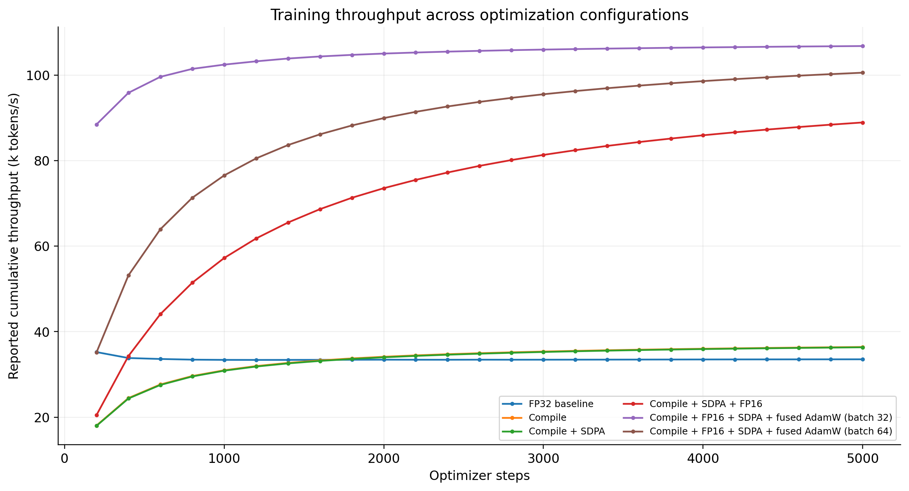
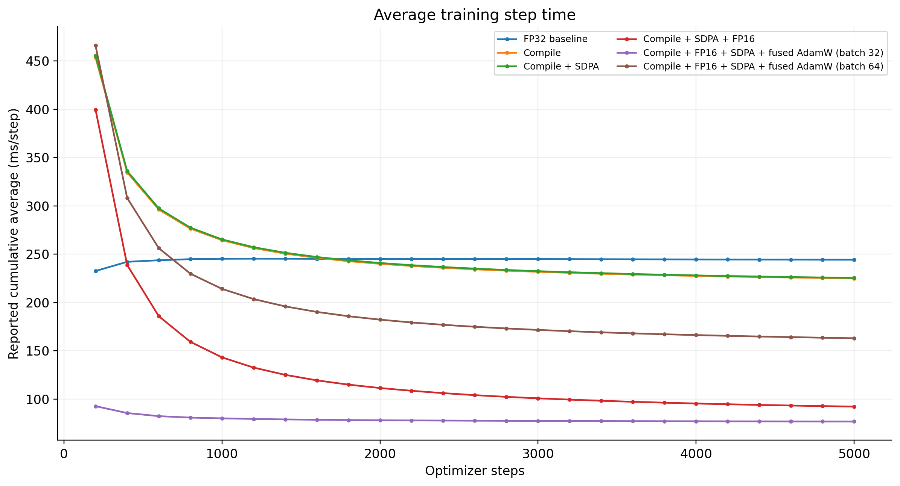
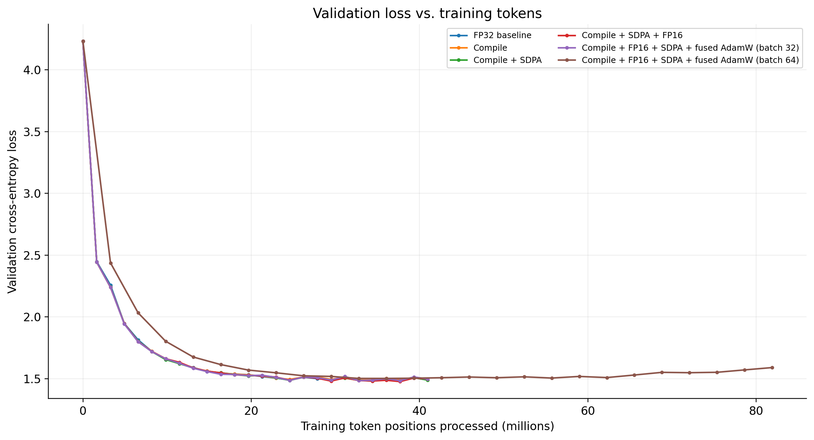
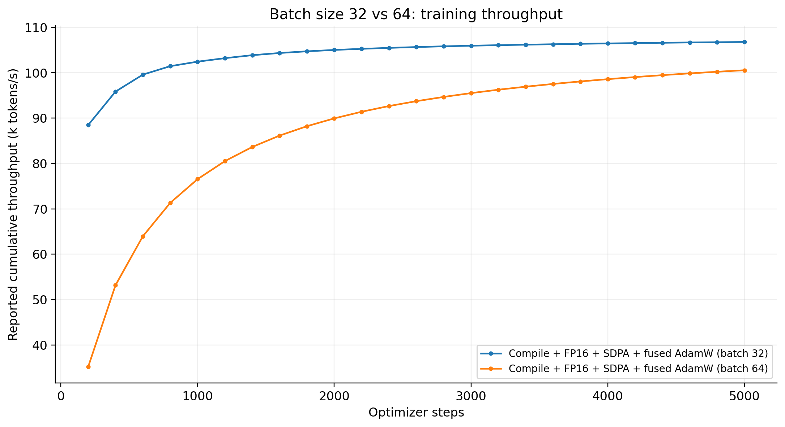
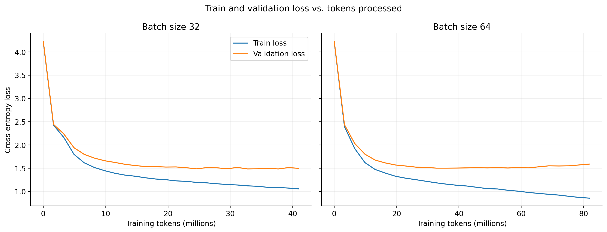

# Training a small GPT on a T4: an optimization log

A character-level GPT was implemented in PyTorch (just pretraining), following Andrej Karpathy’s Neural Networks: Zero to Hero series, and was subsequently used to investigate which training optimizations provide measurable benefits on a single NVIDIA T4 GPU. Compilation, scaled dot-product attention, mixed precision, and a fused optimizer were introduced incrementally to evaluate their effects on training performance. The impact of doubling the batch size on training throughput was also examined.

This remains a small-scale experimental model, with its limitations in training quality reflected in the gap between training and validation loss. Nevertheless, the optimization techniques explored here are relevant to large-scale pretraining, where improvements in computational efficiency can translate into substantial savings in training time and resources.

This repository records the code used to plot the results and the raw training logs. It is an experiment with a **10.79M-parameter model**, not a claim about performance at large-model scale. The most noticeable result in this set of runs was an increase in *reported cumulative training throughput* from roughly **33.5k to 106.8k token positions/s** (about **3.18×**) at batch size 32. These figures include early-run overhead and should not be confused with warmed-up steady-state throughput.

## Model and measurement setup

| Item | Setting |
| --- | --- |
| Task | Character-level next-token prediction on Shakespeare text |
| GPU | NVIDIA T4 (Google Colab) |
| Model size | 10,788,929 parameters |
| Transformer | 6 layers, 6 attention heads, embedding dimension 384 |
| Sequence length | 256 tokens |
| Batch size | 32, except the final experiment at 64 |
| Optimizer | AdamW, learning rate `3e-4` |
| Training | 5,000 optimizer updates per run |
| Evaluation | Train and validation losses sampled periodically |

At batch size 32, each update processes `32 × 256 = 8,192` input token positions; batch size 64 processes `16,384`. These are **character-token positions**, not unique training characters, and they are not directly comparable to the number of subword tokens used in most larger LLM benchmarks.

The recorded time covers the forward pass, backward pass, and optimizer update. It excludes batch preparation and evaluation. GPU synchronization was used around the timed region. The log reports average step time and throughput that **appear to be cumulative from the start of each run**: compilation and early warm-up can therefore affect even the final reported average. There are no repeated-run error bars or peak-VRAM measurements in this experiment.

## The sequence of experiments

Each row *adds to the preceding configuration*. In particular, **both fused-AdamW runs retain `torch.compile`, SDPA, and FP16 autocast**.

| Run | Configuration | Batch | Final logged throughput (token positions/s) | Final logged mean step time |
| --- | --- | ---: | ---: | ---: |
| 1 | FP32 baseline: manual attention, regular AdamW | 32 | 33,542 | 244.23 ms |
| 2 | Baseline + `torch.compile` | 32 | 36,423 | 224.91 ms |
| 3 | Run 2 + scaled dot-product attention (SDPA) | 32 | 36,347 | 225.38 ms |
| 4 | Run 3 + FP16 autocast | 32 | 88,910 | 92.14 ms |
| 5 | Run 4 + fused AdamW | 32 | 106,777 | 76.72 ms |
| 6 | Same full stack as run 5, batch size 64 | 64 | 100,545 | 162.95 ms |

*Values are transcribed from the final entries in the supplied log, not independently repeated benchmarks.*

### 1. Start with a straightforward FP32 baseline

The starting model uses ordinary PyTorch linear layers, explicitly computed causal attention, and AdamW. This provides a reference before introducing compiler or mixed-precision effects. At the end of the baseline run, the log reports **33,542 token positions/s**, with a cumulative mean of **244.23 ms/update**.

### 2. Compile the model

`torch.compile(model)` lets PyTorch capture and optimize parts of the model computation, potentially reducing Python and kernel-launch overhead and fusing compatible operations. Compilation itself has an up-front cost, particularly on the first execution.

Adding compilation moved the final logged figure to **36,423 token positions/s**. The early compiled measurements were much slower, so the changing cumulative average is as important to understand as the final number. I would not interpret this plot as a steady-state compiler speedup.



*Figure 1. Throughput reported at each evaluation checkpoint. The compiled runs' early measurements include setup and warm-up effects; the curves are not instantaneous tokens/s.*

### 3. Replace manual attention with SDPA

The initial attention implementation explicitly builds the attention-score matrix, applies a causal mask, runs softmax and dropout, and multiplies by the values. `torch.nn.functional.scaled_dot_product_attention` expresses this as one operation and allows PyTorch to select an available optimized backend. Causal masking is handled by `is_causal=True`; dropout must be set to zero during evaluation.

```python
out = F.scaled_dot_product_attention(
    q, k, v,
    is_causal=True,
    dropout_p=dropout if self.training else 0.0,
)
```

This experiment is labeled **SDPA**, not guaranteed FlashAttention: the log does not identify which CUDA backend executed. The final reported throughput was **36,347 token positions/s**, effectively unchanged from compilation alone in these runs. With a sequence length of 256 and this small model, an attention rewrite does not automatically translate into a measurable end-to-end improvement.

### 4. Add FP16 mixed precision

The T4 can accelerate eligible FP16 operations using Tensor Cores. Autocast lets PyTorch use lower precision for suitable operations without converting every model parameter to half precision. FP16 training uses gradient scaling to reduce the risk of small gradients underflowing.

```python
scaler = torch.amp.GradScaler("cuda")

optimizer.zero_grad(set_to_none=True)
with torch.autocast(device_type="cuda", dtype=torch.float16):
    logits, loss = model(xb, yb)

scaler.scale(loss).backward()
scaler.step(optimizer)
scaler.update()
```

**Compilation and SDPA remain enabled in this run.** The final logged throughput increased from **36,347 to 88,910 token positions/s** after adding FP16 autocast. This is the largest observed step-change in the sequence, although one run per configuration does not establish how much of the difference would persist across repeated, fully warmed-up measurements.



*Figure 2. Logged cumulative average time per update. In particular, a declining curve can reflect the early compilation cost being amortized over more steps.*

### 5. Fuse the AdamW update

AdamW updates model parameters using gradients and optimizer state. With `fused=True`, supported CUDA operations in the optimizer update can be combined, reducing overhead relative to separate elementwise operations.

```python
optimizer = torch.optim.AdamW(
    model.parameters(), lr=learning_rate, fused=True
)
```

**This configuration still includes compilation, SDPA, and FP16 autocast.** Its final logged throughput was **106,777 token positions/s**, versus **88,910** for the preceding configuration. This is an observed difference between consecutive cumulative runs, not an isolated microbenchmark of the optimizer kernel.

### 6. Check that faster training does not change the learning story

Performance numbers alone are insufficient: the model also needs to keep learning. The following figure plots validation loss against *training token positions processed*, rather than optimizer steps. This becomes essential when comparing different batch sizes, because one batch-64 update sees twice the tokens of a batch-32 update.



*Figure 3. Validation loss across all six runs at their recorded training-token budgets. These are sampled evaluation losses, not full-dataset measurements.*

The batch-32 runs have broadly similar validation-loss trajectories in the supplied log. Their small differences are not enough to claim that one optimization improves language-model quality. The main finding is a training-speed change without an obvious loss-trajectory disruption in these runs.

### 7. Double the batch size: more tokens per update, but not more throughput

I then changed only the batch size, from **32 to 64**, retaining **`torch.compile` + SDPA + FP16 autocast + fused AdamW**.

Each step now processes twice as many token positions: `16,384` instead of `8,192`. However, at the end of the logged runs, throughput was **100,545 token positions/s** for batch 64 versus **106,777** for batch 32. Larger batches increased the work per update, but did not improve total throughput on this setup.



*Figure 4. Reported cumulative throughput for the two fully optimized configurations. This is a two-point batch-size comparison, not a search for the optimal batch size.*

There is also a learning comparison. At the *same step number*, batch 64 has processed twice as many tokens, so its lower training loss at step 3,400 is not an equivalent-budget result. At roughly matched exposure, batch 64 at step 1,600 has processed **26.2M** token positions (validation loss **1.5237**), while batch 32 at step 3,200 has processed **26.2M** (validation loss **1.5136**). These are close, but not controlled enough to establish a batch-size effect on generalization.



*Figure 5. Training and validation loss versus processed token positions for the two fully optimized batch sizes. In the longer batch-64 run, training loss continues to fall while validation loss rises; that pattern is consistent with overfitting, but the runs reach different token budgets and validation estimates fluctuate.*

## Inference, and what next

On this particular small GPT/T4 setup, FP16 mixed precision produced the largest observed incremental throughput increase. Compilation gave a smaller improvement, SDPA made little difference to the recorded end-to-end numbers, and fused AdamW coincided with a further increase. Batch size 64 did not improve throughput over batch size 32. **These are observations from sequential single runs, not universal rankings of the techniques.**

The next experiment should separate compilation cost from warm execution: compile and warm up first, then time fixed windows of steps, repeat each configuration, and record peak GPU memory and utilization. An attention-specific profiler trace would also establish whether the fused attention backend actually ran. To compare model quality more rigorously, I would use matched token budgets, consistent evaluation batches, and multiple random seeds.

## Misc.

The source log, plotting notebook, and figures are included in this repository. From the repository root:

Observations are in  `boga_llm_0.txt`. The actual notebook used is `boga_llm_0.ipynb`
```text
.
├── README.md
├── boga_llm_0.txt
├── boga_llm_0.ipynb
└── figures/
    ├── 01_throughput_vs_steps.png
    ├── 02_step_time_vs_steps.png
    ├── 03_validation_loss_vs_tokens.png
    ├── 04_batch_size_throughput.png
    ├── 05_generalization_by_batch.png
```

This repository provides the recorded log and plotting workflow; the original training notebook, complete dependency versions, hardware profiler traces, and saved checkpoints are not included here, so it is **not yet a fully reproducible training benchmark**.

# From the optimization study to a larger pretraining and adaptation experiment

The first part of the repo used a 10.79M-parameter character-level GPT trained on Shakespeare as a controlled environment for studying practical training optimizations on a single NVIDIA T4. That experiment focused primarily on systems questions: compilation, attention implementation, mixed precision, fused optimization, and batch size.

The natural next question was whether the same ideas could be used in a somewhat more realistic language-model training pipeline.

The second stage therefore moves from :

```
character-level Shakespeare
10.79M parameters
5,000-step optimization experiments
```

to:

```
custom BPE tokenizer
TinyStories pretraining
~27.47M-parameter GPT
~256M-token corpus
full supervised fine-tuning
dropout ablation
LoRA parameter-efficient fine-tuning
```

The objective of this extension is still not to build a competitive language model. The model is intentionally small enough to train on a single free NVIDIA T4, but the pipeline now includes many of the components that appear in larger LLM workflows:

- tokenizer training,
- large streamed dataset preprocessing,
- binary token storage,
- mixed-precision pretraining,
- compilation,
- SDPA attention,
- fused AdamW,
- checkpoint selection,
- instruction-dataset reconstruction,
- response-only supervised fine-tuning,
- regularization experiments,
- low-rank adaptation,
- adapter-only checkpoints,
- and controlled qualitative evaluation.
  
This second stage is therefore less about raw benchmark performance and more about understanding the complete lifecycle of a small language model.

### 8. Moving from character-level modeling to BPE

The Shakespeare experiment used characters directly as tokens. For the TinyStories experiments, I instead trained a small byte-pair encoding tokenizer.

The tokenizer was trained from approximately the first 30 million characters of the TinyStories training stream.

The regular BPE vocabulary contains token IDs: 
```
0...4095
```
An explicit end-of-text token was then added:
```
EOT = 4096
```
Giving a real vocab size of 4097.

For the model embedding and language-model head, the vocabulary dimension was padded to: **4160**, as opposing to 'ugly numbers' said by Karpathy. This padding is unrelated to the training batch size. It simply provides a more hardware-friendly matrix dimension.

The model therefore distinguishes between:
```
vocab_size = 4097
padded_vocab_size = 4160
```
During generation, logits corresponding to the padded vocabulary entries are discarded:
```
logits = logits[:, -1, :vocab_size]
```

**Tokenizer implementation**

The tokenizer follows the ordinary BPE procedure:
1. split the text into coarse text pieces,
2. convert each piece to UTF-8 bytes,
3. repeatedly merge the highest-priority byte pair,
4. concatenate the resulting token IDs.

### 9. TinyStories pretraining
The next model was pretrained on: **roneneldan/TinyStories**, using Hugging Face streaming.

Each TinyStories example was tokenized independently and followed by the explicit EOT token.
The training preprocessing stopped after approximately:
```
1,000,000,000 source characters
```

The resulting training stream contained approximately:
```
255,925,379 BPE tokens
```
The validation stream contained approximately:
```
4,886,831 BPE tokens
```
And the flat token streams were written as : **uint16** binary files. The vocabulary contains only 4,097 real IDs, so uint16 is sufficient while reducing storage compared with int32 or int64.

**Why flat binary token files?**

Rather than repeatedly tokenizing text during training, the corpus is converted once and stored as a contiguous token array.
The training loader then memory-maps the binary file and samples windows directly.

Conceptually: 
```
train_data = np.memmap(train_path, dtype=np.uint16,mode="r")
```
and a training example is a randomly selected window:
```
x = tokens[i : i + 256]
y = tokens[i + 1 : i + 257]
```
This avoids Python text-processing overhead during the training loop.


### 10. The larger GPT

The second GPT uses the following configuration:

| Component | Setting |
| :--- | :--- |
| Parameters | ~27.47M |
| Layers | 8 |
| Attention heads | 8 |
| Embedding dimension | 512 |
| Head dimension | 64 |
| Context length | 256 |
| Real vocabulary | 4,097 |
| Padded vocabulary | 4,160 |
| Training batch size | 64 |
| Base-model dropout | 0.0 |
| Training hardware | NVIDIA T4 |
| Dataset | TinyStories |

The token embedding matrix and LM head are tied.
The positional embedding is learned:
```
self.position_embedding_table = nn.Embedding(block_size, n_embd)
```
so the model was pretrained only for 256 positions.

### 11. Attention Implementation

The first part of the repository already showed that explicitly expressing attention through PyTorch's scaled-dot-product attention API makes it possible for PyTorch to select optimized kernels when available.

The larger GPT therefore uses: ```scaled_dot_product_attention()```

(As in the earlier optimization experiment, I refer to this as SDPA, not automatically as FlashAttention, because the exact backend selected depends on PyTorch, hardware, tensor shapes and runtime conditions.)

Although a commented out code for the manual attention implementation is given. 

### 12. Efficient pretraining configurations

The optimized training stack from the earlier small-model experiment was carried into the larger run:

```
SDPA + torch.compile + FP16 autocast + gradient scaling + fused AdamW
```
The intention here was no longer to isolate each optimization individually. That was already the role of the earlier 10.79M-parameter experiment. Instead, the complete stack was used as the practical training configuration.


**torch.compile**
```
model = torch.compile(raw_model, mode="reduce-overhead")
```
The compiled object contains compiler wrappers and is not the clean object whose state I want to serialize.
Therefore checkpoints are saved from: 
```
raw_model.state_dict()
```


**FP16 mixed precision**
The T4 supports efficient FP16 computation.
The forward pass is executed under autocast:

```
with torch.autocast(device_type="cuda", dtype=torch.float16):

    logits, loss = model(xb, yb)
```
Gradient scaling is used to protect small FP16 gradients from numerical underflow:

```
scaler = torch.amp.GradScaler("cuda")
```
followed by :

```
scaler.scale(loss).backward()
scaler.step(optimizer)
scaler.update()
```

During pretraining there was no gradient clipping, so explicitly unscaling the gradients was unnecessary.
Later, during SFT, gradient clipping was added, so the ordering becomes:

```
scaler.scale(loss).backward()
scaler.unscale_(optimizer)
torch.nn.utils.clip_grad_norm_(raw_model.parameters(),1.0)
scaler.step(optimizer)
scaler.update()
```

The unscale step must occur before gradient clipping because clipping should operate on the real gradient magnitudes rather than the temporarily scaled ones.

**Fused AdamW**
```
torch.optim.AdamW(model.parameters(),...,fused=True)
```
on CUDA.
This retains the same optimization investigated earlier in the repository(the first part), but now as part of the normal training stack rather than as a standalone ablation.

### 13. Pretraining Run

The larger model was pretrained for: 35,000 optimizer steps.
with batch_size : 64 and context length : 256

Each optimizer step therefore samples: 64 x 256 = 16, 384 tokens.
Across 35,000 updates: 35,000 x 16,384 = 573,440,000 sampled token positions.

The tokenized corpus contains: 255.93M tokens

So, the training run corresponds to roughly: 573.44 / 255.93 = 2.24 corpus-equivalents

This should not be interpreted as 2.24 deterministic epochs.
The loader samples random windows from a flat token stream, so some positions may be sampled multiple times while others may be sampled fewer times.

**Best pretraining checkpoint**

The best recorded validation checkpoint occurred approximately at:
```
step 34,800
validation loss ≈ 1.4173
```
This best validation checkpoint rather than the final optimizer state was used as the starting point for the downstream adaptation experiments.

# Pretrained figures here
Figure 6. Training and validation loss for the ~27.47M-parameter TinyStories pretraining run. The selected downstream checkpoint corresponds to the best observed validation loss rather than necessarily the final update.


### 14. From language modeling to supervised instruction tuning
Pretraining teaches the model the statistical structure of TinyStories text.
It does not automatically teach the model to interpret structured requests such as:
```
Words: snow, meadows, cold
Features: Dialogue
Summary: A far land having meadows, got snow in winter and was cold.
Story:
```
For that, the next stage uses: roneneldan/TinyStoriesInstruct  and and supervised fine-tuning.

### 15. A dataset-format problem: TinyStoriesInstruct streaming

One non-obvious issue appeared during preprocessing.
When the dataset was accessed through Hugging Face streaming, each returned row did not necessarily correspond to one complete instruction/story example.
Instead, individual lines appeared as separate rows.
A logical example looked like:
```
Features: Dialogue
Words: quit, oak, gloomy
Summary: ...
Story:

Once upon a time ...
...
<|endoftext|>
```
The metadata order can also vary.
For example: Summary may appear after story text in some examples.

Therefore it is unsafe to reconstruct samples simply by assuming that every: 'Features:' line begins a new example.

**Reconstructing complete examples**
The reliable boundary is: <|endoftext|>

The dataset was therefore reconstructed as:
```
def iter_instruct_examples(split):

    ds = load_dataset("roneneldan/TinyStoriesInstruct", split=split, streaming=True)

    current = []
    for ex in ds:
        line = ex["text"]
        current.append(line)
        if "<|endoftext|>" in line:
            yield "\n".join(current).strip()

            current = []
```
This is an important preprocessing detail because instruction tuning on incorrectly segmented rows would train on malformed examples.


### 16. Parsing metadata and story text

The parser accepts the metadata fields:

```
META_PREFIXES = (
    "Features:",
    "Words:",
    "Summary:",
    "Random sentence:",
)
```
and separately collects the story body.
The structured prompt becomes approximately:
```
Features: ...
Words: ...
Summary: ...
Story:
```
while the response is the story itself.
The metadata is preserved as conditioning context.

### 17. Response-only supervised fine-tuning
A major design choice was to compute cross-entropy loss only on the desired answer.

The model still receives the entire prompt:
```
metadata
+
Story:
+
story response
```
but prompt-token targets are replaced with: -100
which PyTorch cross entropy ignores.
The forward function therefore uses:
```
loss = F.cross_entropy(
    logits,
    targets,
    ignore_index=-100
)
```
**Important distinction**
Response-only masking does not mean that prompt tokens are removed from the computation.
The transformer still processes them.
A response token may attend to prompt tokens, and gradients from response prediction still flow through computations involving the prompt representation.
The only thing removed is the direct objective:
```
"predict the next prompt token"
```
The model is instead optimized for:
```
P(response | prompt)
```
rather than spending loss capacity reconstructing the instruction itself.

### 18. Context-length decision
Before creating the final SFT files, I measured the tokenized lengths of 5,000 reconstructed instruction examples.
Approximate statistics were:

| Quantity | Mean | Median | p90 | p95 | p99 | Max |
| :--- | :--- | :--- | :--- | :--- | :--- | :--- |
| **Full example** | 276.4 | 260 | 352 | 419 | 640 | 1163 |
| **Prompt** | 53.8 | 55 | 87 | 95 | 114 | 151 |
| **Story** | 222.7 | 206 | 295 | 351 | 574 | 1075 |

Approximately:
```
46.9% fit within 256 tokens
93.1% fit within 384
97.5% fit within 512
```
At first, increasing the fine-tuning context to 512 appeared attractive because it would retain almost all examples.
However, the pretrained model uses learned absolute positional embeddings and had only been trained at context length 256.
Increasing the SFT context would therefore introduce two simultaneous adaptation problems:
```
instruction tuning + learning previously unseen positional embeddings
```
That would make the experiment harder to interpret.
The final decision was therefore: keep block_size = 256, and retain only complete instruction examples that fit within the existing context. Long stories were not truncated merely to increase dataset size.
This keeps the SFT experiment focused on instruction adaptation rather than context extension.

### 19. Building the SFT dataset
The final prepared training set contains approximately: 49,020 examples, inspected from 89,191 examples.

Training stats:
| Statistic | Value |
| :--- | :--- |
| **Kept examples** | 49,020 |
| **Total sequence tokens** | 10,617,686 |
| **Supervised response tokens** | 8,000,035 |
| **Mean sequence length** | 216.60 |
| **Mean supervised tokens/example** | 163.20 |

Validation stats:
| Statistic | Value |
| :--- | :--- |
| **Kept examples** | 3,072 |
| **Too long** | 1,953 |
| **Invalid** | 1 |
| **Total sequence tokens** | 663,197 |
| **Supervised response tokens** | 500,031 |
| **Mean sequence length** | 215.88 |
| **Mean supervised tokens/example** | 162.77 |

**Stored files**
The preprocessed instruction dataset is stored as six files:
```
train_ids.bin
train_mask.bin
train_offsets.npy

val_ids.bin
val_mask.bin
val_offsets.npy
```

Token IDs use: uint16
while the loss mask uses: uint8
and sequence offsets use: int64

### 20. Why offsets are necessary for SFT?
Pretraining samples arbitrary contiguous windows from one long token stream. SFT should not do that.
Instruction examples have semantic boundaries:
```
prompt
→ response
→ EOT
```
Randomly sampling through the flattened stream could create batches that begin halfway through one instruction and end inside another. Offsets therefore preserve individual examples.
The SFT loader randomly selects complete examples and constructs:
```
x = ids[:-1]
y = ids[1:]
```
The target loss mask is shifted correspondingly: 
```target_mask = mask[1:]```
Prompt and padding targets become: -100 and ignored by the crossentropy.

### 21. Padding and causal attention

SFT examples have different lengths, so each sequence is padded to 256 tokens.
Input padding uses a valid token ID, while padded target positions are: -100, and therefore produce no loss. No separate padding-attention mask is required in this specific causal setup because padding occurs only after the valid sequence.
A valid token cannot attend to future padded tokens under causal attention.
Thus padding does not affect predictions for the real response positions.


### 22. Full supervised fine-tuning configuration
The best pretrained TinyStories checkpoint is loaded as the initialization. A fresh optimizer is created (Optimizer state from pretraining is not resumed.)
The main full-SFT configuration is:

| Setting | Value |
| :--- | :--- |
| **Initialization** | best pretrained checkpoint |
| **Context** | 256 |
| **Batch size** | 32 |
| **SFT steps** | 3,200 |
| **Learning rate** | 3e-5 |
| **Warmup** | 100 steps |
| **Minimum LR** | 3e-6 |
| **Scheduler** | cosine |
| **Optimizer** | fused AdamW |
| **Precision** | FP16 autocast |
| **GradScaler** | enabled |
| **Gradient clipping** | 1.0 |
| **Evaluation interval** | 100 steps |
| **Evaluation batches** | 50 |
| **Loss** | response-only cross entropy |
| **Base dropout** | 0.0 |

**Learning-rate schedule**
Warmup uses:
```
if it < warmup_iters:
    return (learning_rate* (it + 1) / warmup_iters)
```
and Aater warmup, the learning rate follows cosine decay toward the minimum LR.

### 23. Interpreting SFT step counts

There are approximately: 49,020 training examples, and the batch_size is 32. So, one full deterministic pass contain approximately: 49,020/32 = 1532 optimizer steps.

The loader samples examples randomly with replacement.
Therefore:
1600 steps is approximately one dataset-equivalent of sampling,and 3200 steps is roughly two. (Please remember, they are not literal deterministic epochs.)

### 24. First full-SFT run: 1,600 steps

The first complete SFT experiment used: 
```
dropout = 0.0
steps = 1,600
```
The model improved rapidly from its pretrained initialization.
The best validation loss was approximately: 1.1136, around step 1500.

### Full SFT: 3,200 steps

The primary full-SFT experiment extended training to: 3200 steps, with base-model dropout still: 0.0

The best checkpoint occurred at: 3000, with response-only validation loss: 1.0995801

# figure placement
Figure 8. Response-only training and validation loss for the 3,200-step full fine-tuning run initialized from the best pretrained checkpoint.

### 25. Does adding dropout improve SFT?

Three dropout ablations were done: 0.0, 0.05, 0.1
| SFT configuration | Best validation loss | Best step |
| --- | ---: | ---: |
| Dropout 0.00 | **1.0996** | 3000 |
| Dropout 0.05 | 1.1337 | 3000 |
| Dropout 0.10 | 1.1707 | 2300 |

On this experiment, increasing dropout worsened the best held-out response-only validation loss.

# Suggested figures

Figure 9. Response-only SFT training loss for dropout values 0.0, 0.05 and 0.10.
Figure 10. Response-only held-out validation loss for the three dropout settings. The zero-dropout run achieves the lowest measured validation loss.

### 26. Validation loss and generation quality are related, but not identical

The zero-dropout model achieved the best aggregate validation loss.
However, individual sampled stories occasionally looked better from the 0.05 or 0.10 dropout checkpoints.

For example, one model could produce: better local causal flow
while another achieved: better average next-token likelihood
his is not contradictory.
Cross-entropy measures the average probability assigned to the reference continuation.
A single stochastic generation also depends on:

```
sampling seed,
temperature,
local probability differences,
and the particular prompt.
```
Therefore qualitative comparison should supplement validation loss rather than replace it.

To reduce cherry-picking, I used a fixed collection of prompts and generated from every checkpoint using the same:
```
temperature
random seed
maximum generation length
```

### 27. Pretraining versus instruction tuning

A representative prompt is:
```
Words: snow, meadows, cold
Features: Dialogue
Summary: A far land having meadows, got snow in winter and was cold.
Story:
```
The pretrained model produced:
```
Greature:
"Yum! Let's play in the meadow tomorrow!"
Bunny:
Then Bird:
"Let's find out who left the meadow hop the next day."
Summer Hippo:
"Choooshy! Let's believe."

The two friends ran back home, thinking of the special moment that they had just made.
```

The output contains TinyStories-like lexical material but does not reliably understand the structured conditioning format.
The full-SFT model produced a coherent continuation centered on:
```
Once upon a time there was a far land. It was full of cold things. It was time for the cold it snowed.
One day, the sky began to turn grey. The snowflakes started to fall from the sky. The snowflakes and trees were frozen. It was so cold that the middle of the snow was icy.
...
```
The model still did not perfectly satisfy every requested constraint, especially the requested dialogue feature.
This illustrates the purpose of SFT:
```
pretraining learns the distribution;
SFT teaches how the prompt should control generation.
```

### 27. Remaining instruction-following weaknesses

Even after SFT, the model is still only ~27M parameters and trained on a relatively narrow synthetic dataset.
Common failures include:
- ignoring Features: Dialogue,
- partially using the supplied words,
- introducing new characters not implied by the prompt,
- entity mutations,
- repetitive story structure,
- contradictory events,
- incomplete summary adherence.
These examples are useful: they make the limitations of the toy-scale setup visible.
The project is not intended to imply that the model has become a general instruction-following assistant.

### 28. Parameter-efficient fine-tuning with LoRA
After establishing a full-SFT baseline, the next question was:
How much of the instruction-tuning behavior can be recovered while updating only a small low-rank parameter set?

For this experiment, the model again starts from: best_pretrained_model.pt

rather than from the full-SFT checkpoint.
This produces a clean experimental branch:
```
                         ┌── full SFT
best pretrained model ───┤
                         └── LoRA SFT
```

LoRA was applied to transformer linear layers including:
```
query projections,
key projections,
value projections,
attention output projections,
and feed-forward linear layers.
```

The tied language-model head was deliberately excluded.

| Setting | Value |
| :--- | :--- |
| **Base checkpoint** | Best pretrained model |
| **Rank** | 8 |
| **Alpha** | 16 |
| **LoRA dropout** | 0.0 |
| **Context** | 256 |
| **Batch size** | 32 |
| **Steps** | 3,200 |
| **Learning rate** | 1e-4 |
| **Warmup** | 100 |
| **Minimum LR** | 1e-5 |
| **Scheduler** | Cosine |
| **Optimizer** | Fused AdamW |
| **Precision** | FP16 autocast |
| **Gradient clipping** | 1.0 |
| **Dataset** | Same TinyStoriesInstruct subset |
| **Objective** | Same response-only SFT loss |

The LoRA learning rate is larger than the full-SFT learning rate:

```
LoRA:     1e-4
Full SFT: 3e-5
```
because only the low-rank adapters are being optimized.
The base-model parameters remain frozen.


### 29. SFT vs. LoRA training result

For the clean: pretrained --> LoRA, experiment, validation loss improved from the unadapted response-only baseline toward the instruction-tuned regime.

| Model | Starting checkpoint | Updated parameters | Best SFT validation loss |
| :--- | :--- | :--- | :--- |
| **Pretrained** | — | 0 | ~1.39 before adaptation |
| **Full SFT** | Best pretrained | ~all 27.47M | 1.0996 |
| **LoRA, r=8** | Best pretrained | Low-rank adapters only | 1.1716 |

The comparison suggests: full SFT gives the best held-out response likelihood, while, LoRA recovers a substantial fraction of the instruction-following behavior while updating far fewer parameters.

Using the same prompt:
```
Words: snow, meadows, cold
Features: Dialogue
Summary: A far land having meadows, got snow in winter and was cold.
Story:
```

the original pretrained model produced:
```
Greature:
"Yum! Let's play in the meadow tomorrow!"
Bunny:
Then Bird:
"Let's find out who left the meadow hop the next day."
Summer Hippo:
"Choooshy! Let's believe."

The two friends ran back home, thinking of the special moment that they had just made.
```

The full-SFT model produced:
```
Once upon a time there was a far land. It was full of cold things. It was time for the cold it snowed.
One day, the sky began to turn grey. The snowflakes started to fall from the sky. The snowflakes and trees were frozen. It was so cold that the middle of the snow was icy.
```

The LoRA model produced:
```
Once upon a time there was a big, big, warm field. In the field lived a little bunny. The bunny loved to play and jump around.
One day, the bunny decided to make a snowflake.
```
This individual LoRA sample has fairly clean local story structure:

```
bunny
- snow
- becomes cold
- returns home
- gets warm
```
but misses several requested constraints.
Thus qualitative generation and validation loss tell a consistent overall story: LoRA learns the instruction format, but full SFT remains more accurate on the held-out response objective.

### 30. LoRA on top of the fully fine-tuned model

I also tested a second, deliberately different setup:
```
best pretrained
- full SFT
- LoRA on the same instruction dataset
```
This is not the clean full-SFT versus LoRA comparison.
Instead, it asks whether another low-rank adaptation stage helps after the model has already been fully optimized on the same task.
At LoRA step 0, the model already had approximately:validation loss ~= 1.099


The post-step-0 model never improved on the starting full-SFT checkpoint.
The qualitative sample also drifted away from the requested content, introducing unrelated bears, deer, a lake and warm weather.
The result is unsurprising in hindsight.
The full-SFT model had already been optimized for the same data and objective.
Applying another relatively high-learning-rate low-rank update introduces no new supervision and can move the model away from the already good solution.
This experiment therefore supports a useful distinction:

```
LoRA as an alternative to full fine-tuning:
meaningful comparison.

LoRA after full fine-tuning on exactly the same task:
mostly redundant in this setup.
```

Maybe: LoRA on top of full SFT would become more interesting if the second dataset represented a genuinely different specialization

**The complete full-model checkpoints are not committed to this repository.
They are significantly larger than the code, figures and logs, and the primary purpose of the repository is to document the experiment rather than host model artifacts.


### 31. Main experimental takeaways


Training systems
The first 10.79M-model experiment showed that the largest measured throughput change on the tested T4 setup came after introducing FP16 mixed precision, while compilation and fused AdamW also changed the observed end-to-end training speed.
Those observations motivated using the full optimized stack for the larger TinyStories model.
Pretraining
A ~27.47M-parameter GPT could be trained from scratch on a free T4 using:
```
SDPA
torch.compile
FP16
GradScaler
fused AdamW
```

with a custom BPE tokenizer and a ~256M-token training stream.
SFT
Response-only full fine-tuning transformed the model from a generic TinyStories continuation model into one that responded meaningfully to structured story instructions.
The strongest full-SFT checkpoint reached:
validation loss = 1.0996

Dropout
Introducing dropout only at SFT time did not improve held-out response loss.
The observed ranking was:
```
dropout 0.00 - 1.0996
dropout 0.05 - 1.1337
dropout 0.10 - 1.1707
```

LoRA
Rank-8 LoRA from the same pretrained checkpoint successfully learned substantial instruction-following behavior while training only a small subset of parameters.
Its best validation loss was approximately:1.1716
versus:1.0996 for full fine-tuning.

The experiment therefore illustrates the expected trade-off:
full SFT:

more trainable parameters,
better task loss.

LoRA:
far fewer trainable parameters,
smaller adaptation checkpoint,
some loss in task performance.

LoRA after full SFT
Applying LoRA on top of the already fully fine-tuned model using the same dataset did not improve the starting checkpoint.
The useful role for this setup would instead be a new specialization task, not another pass over the same objective.


